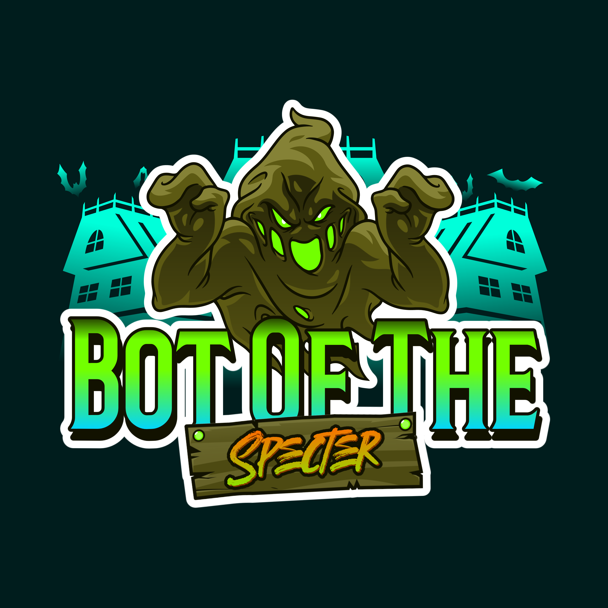

<p align="center">
  
</p>

<h1 align="center">BotOfTheSpecter Desktop</h1>

<p align="center">
  The desktop control room for your stream — bridge OBS Studio to BotOfTheSpecter
  and run your whole channel from a single window.
</p>

---

## What is it?

BotOfTheSpecter Desktop is a cross-platform app (Windows, macOS, Linux) that connects
**OBS Studio** and your **BotOfTheSpecter** account in real time. It mirrors what's happening
on your stream — scenes, audio, recording, chat, redemptions, follows/subs/bits/raids — into
one dashboard, and lets you act on it: switch scenes, toggle sources, fire commands, and build
automations that react to events as they happen.

Think of it as the bridge between OBS and your bot, plus a live control panel for the things
you'd otherwise juggle across OBS, Twitch, and the bot dashboard.

## Features

### Live control & monitoring
- **Dashboard** — bot status, Twitch live state (viewers, game, title) and OBS/relay health at a
  glance, with a rolling activity feed.
- **OBS Control** — switch scenes, toggle source visibility and filters, manage the audio mixer
  (mute, volume, live peak meters), and start/stop streaming, recording, the replay buffer and the
  virtual camera. Accurate LIVE timecode plus bitrate, CPU, FPS and dropped-frame stats, and a raw
  event log.
- **Chat & Mod** — live Twitch chat with moderation events (bans, timeouts, deletes, clears).
- **Channel Points** — view your Twitch reward redemptions and wire them into actions.

### Engagement & automation
- **Commands** — browse built-in, custom and viewer commands; enable/disable built-ins and set
  their permission level.
- **Automations & Actions** — a visual rules engine. Triggers (chat message/command, follow, sub,
  bits, raid, channel-point redemption, stream go-live/end, OBS scene switch, OBS stream start/stop,
  manual, public webhook) fire reusable **Actions**: call a webpage, set a variable, run a command,
  play a sound, speak via TTS, toggle another automation, send a webhook, or drive Twitch directly
  (toggle a reward, run ads, create a marker, start/stop polls and predictions, slow mode, clip).
  Organize them in folders, gate them with checks, and serialize them with named queues.
- **Variables** — real-time event data for your commands and checks: last follower / cheer / sub /
  raid / redemption / donation, plus session and lifetime counters and live stream status.

### System
- **Logs** — a filterable, searchable event stream across OBS, Twitch, the relay and the bot.
- **Settings** — API key, light/dark/system theme, density, and OBS stream-timer calibration. Your
  key is validated before connecting.

> **On the roadmap:** the Alerts, Soundboard, Song Requests, Timers and Giveaways/Polls/Predictions
> screens are already in the app and waiting on their backend services.

## How it works

1. **Add your API key** — paste your BotOfTheSpecter API key in Settings; it's validated against the
   BotOfTheSpecter API and then connects to the relay.
2. **Connect OBS** — enter your OBS WebSocket host, port and password on the OBS Control screen (or
   let it auto-connect on launch).
3. **Go live** — the app forwards OBS events to the bot and surfaces chat, redemptions and stream
   status in real time.
4. **Automate** — build automations that react to triggers with reusable actions.

## Requirements

- **OBS Studio 28 or newer** with **obs-websocket 5.x** enabled (OBS → *Tools → WebSocket Server
  Settings*).
- A **BotOfTheSpecter account** and **API key** (from your BotOfTheSpecter dashboard).
- **Windows, macOS, or Linux.**

---

## Install

### Download a build

Grab the latest release for your platform from the
**[Releases page](https://github.com/YourStreamingTools/BotOfTheSpecter-Connector-App/releases)**,
then launch it — no Python or other runtime required.

### Run from source

Requires **Node.js 18 or newer**.

```bash
git clone https://github.com/YourStreamingTools/BotOfTheSpecter-Connector-App.git
cd BotOfTheSpecter-Connector-App
npm install
npm run dev        # launch with hot reload
```

On Windows you can instead double-click **`run.bat`** — it checks your Node version, installs
dependencies on first run, and starts the app.

## Development

```bash
npm run dev        # launch the app with hot reload
npm test           # run unit + component tests (Vitest)
npm run typecheck  # strict TypeScript check (renderer + node projects)
npm run build      # production build → out/
```

### Project layout

- `src/main` — Electron main process: config, window, and the OBS / relay / Twitch / commands /
  automation services.
- `src/preload` — the typed `window.api` contextBridge.
- `src/renderer` — React UI (shell, screens, design tokens).
- `src/shared` — shared constants and the IPC contract.
- `legacy/` — the original PyQt6 connector, preserved for reference.
- `docs/` — project site ([app.botofthespecter.com](https://app.botofthespecter.com)) and version history.

### Configuration

Settings persist to `<userData>/config.json`. On first launch the app imports an existing PyQt
config from `…/BotOfTheSpecter/OBSConnector/config.json` if present. Secrets such as your API key
are redacted from the logs and event views, and OAuth tokens never leave the main process.

> **v2.0** is a full rewrite of the former PyQt6 connector (Electron + React + TypeScript). The
> previous Python app lives under [`legacy/`](./legacy).
